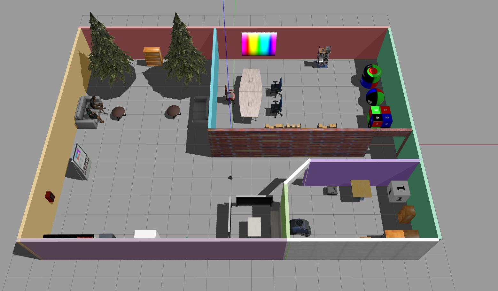
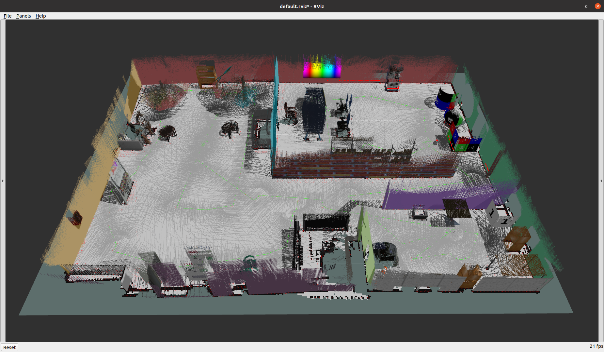
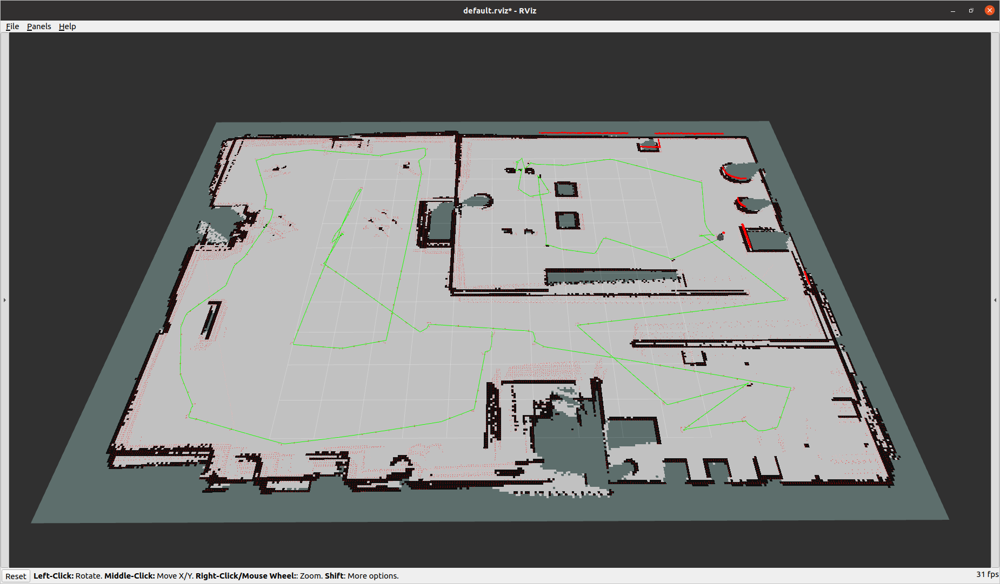
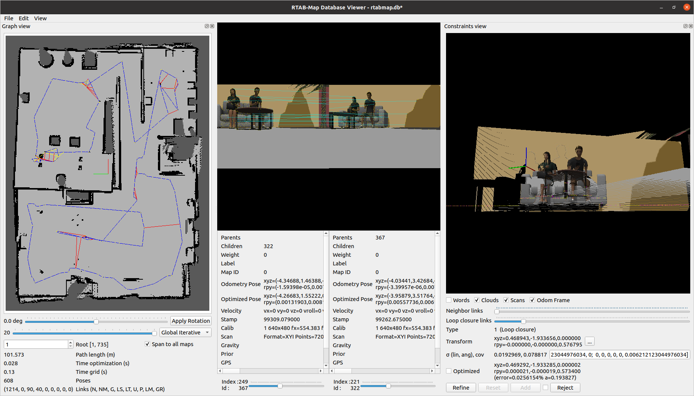

# Map My World

This project aims to perform mapping using RGB-D based RTAB-Map (Real-Time Appearance-Based Mapping) Algorithm.


:--:
*Robot mapping the environment*

## Directory Tree 

```
.Map My World                                       # Map My World  Project
├── assets                                          # simulation media
│   ├── mapinspection.png
│   ├── Rviz.gif
│   ├── Rviz.mp4
│   └── SimulatedEnvironment.jpg
├── Readme.md                                       # project info
├── robot_mapping                                   # robot_mapping package
│   ├── CMakeLists.txt                              # compiler instructions
│   ├── launch                                      # launch folder for launch files
│   │   ├── floorplan.launch
│   │   ├── localization.launch
│   │   ├── mapping.launch
│   │   └── robot_description.launch
│   ├── meshes                                      # meshes folder for sensors
│   │   ├── bases
│   │   │   └── burger_base.stl
│   │   ├── hokuyo.dae
│   │   ├── kinect.dae
│   │   ├── kinect.png
│   │   ├── sensors
│   │   │   ├── astra.dae
│   │   │   ├── astra.jpg
│   │   │   ├── lds.stl
│   │   │   ├── r200.dae
│   │   │   └── r200.jpg
│   │   └── wheels
│   │       ├── left_tire.stl
│   │       └── right_tire.stl
│   ├── package.xml                                 # package info
│   ├── rtabmap.db                                  # .db file for inspecting the created map
│   ├── urdf                                        # urdf folder for xarco files
│   │   ├── common_properties.xacro
│   │   ├── my_robot.gazebo
│   │   └── turtlebot3_burger.urdf.xacro
│   └── worlds                                      # world folder for world files
│       ├── model.config
│       ├── model.sdf
│       ├── model.world
│       └── office.world
└── rtabmap_ros                                     # rtabmap_ros package (subfolders not included)

95 directories, 455 files
```

## Simulated Environment

To implement the project create a simulation environment such that it is easy to extract features for the robot.


:--:
*Simulated Environment*

## Prerequisites

For this project following packages are required. 

Markup : *[rtabmap_ros package](http://wiki.ros.org/rtabmap_ros)
         *[teleop_twist_keyboard package](http://wiki.ros.org/teleop_twist_keyboard)

The rtabmap_ros package should be built from source. In case of errors please check  **Migration Guide New Interface Noetic/ROS2** and make changes to the mapping.launch file accordingly.

## Launch the Project

To launch the project, clone the github repository under src folder is your ros workspace by
```
git clone https://github.com/navoday01/Map-My-World.git
```
Clone the teleop_twist_keyboard package   

launch the robot in the environment to simulate in Gazebo by
```
roslaunch robot_mapping floorplan.launch
```
Open another terminal to run teleop twist keyboard package by 
```
roslaunch robot_mapping teleop.launch
```
## Mapping

To map the environment in RTAB-Map, open a new terminal and run
```
roslaunch robot_mapping mapping.launch
```
Go to the teleop terminal and start navigating the robot around your environment which will result in the 3D and 2D mapping.

|  |
|:----------------------------------:|
|       |
|*3D pointcloud created during mapping*|

|   |
|:------------------------------------:|
|  | 
|*2D occupancy grid created during mapping*|


## Inspecting Simulated Environment

To inspect the generated map, run
```
rtabmap-databaseViewer ~/robot_mapping/rtabmap.db
```


:--:
*Inspecting Created Environment*

## Localization

If map already exists, localization can be performed by running 
```
roslaunch robot_mapping localization.launch
```

